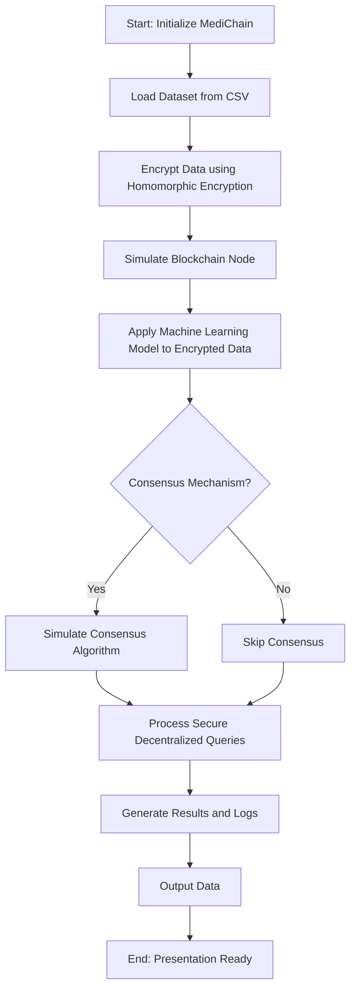

### Description of Each Step:
1. **Load Dataset**:
   - Determine if you're using a CSV file or MySQL database as the input source.
2. **Encrypt Data**:
   - Apply homomorphic encryption to protect the data.
3. **Simulate Blockchain**:
   - Implement a blockchain-like structure where nodes process the data.
4. **Apply ML Model**:
   - Use the encrypted data for predictions or analysis with your ML model.
5. **Consensus Mechanism**:
   - Simulate a simple consensus if multiple nodes are involved.
6. **Process Queries**:
   - Demonstrate how queries are handled securely and decentralized.
7. **Output Results**:
   - Present the processed data and insights while maintaining encryption integrity.

This flowchart and explanation should make the system architecture clear and concise for your `README.md`.
